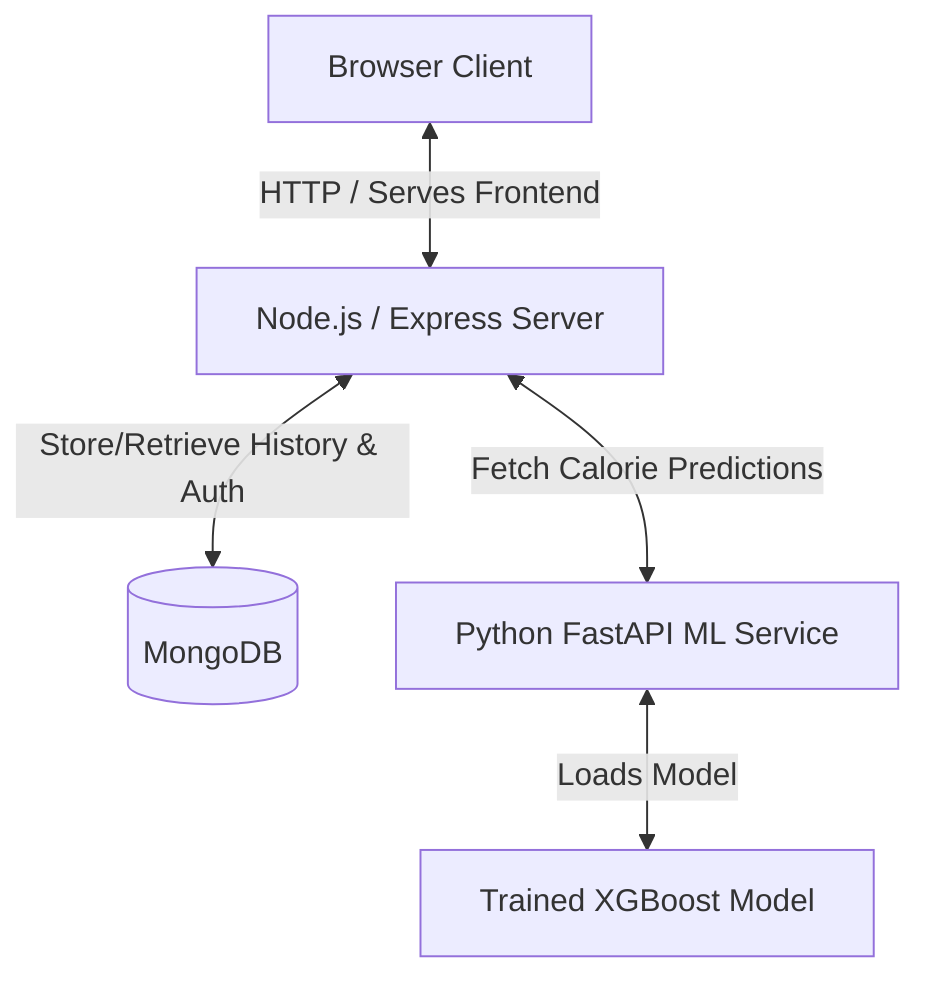

# Calorie Predictor App

A full-stack, machine-learning-powered application that predicts calories burned during a workout based on user physical metrics and exercise intensity. The project features a Node.js/Express backend that manages user accounts, session authentication, and history tracking with MongoDB, a Python FastAPI microservice that runs predictions using a trained machine learning model, and a responsive vanilla HTML/CSS/JS frontend dashboard.

---

## 🏗️ Project Architecture



The application is split into three main components:
1. **Frontend**: Static files served by Express that provide login, registration, and a dashboard showing prediction history and a prediction tool.
2. **Backend**: A REST API that handles authentication (JWT in cookies/headers), user prediction history storage, and proxies calculation requests to the ML service.
3. **ML Service**: A Python microservice that loads a serialized XGBoost model (`Trained_model.sav`) and exposes a `/predict` endpoint.

---

## 🛠️ Tech Stack

### Frontend
- **Structure**: Semantic HTML5
- **Styling**: Vanilla CSS3 (Custom properties/variables, modern grid/flexbox layouts)
- **Logic**: Vanilla JavaScript (Fetch API, dynamic DOM manipulation, LocalStorage)

### Backend
- **Core**: Node.js & Express (ES Modules)
- **Database**: MongoDB with Mongoose ODM
- **Security**: JWT (JSON Web Tokens) for authentication, BCrypt for password hashing, Cookie-Parser, CORS

### ML Service
- **Core**: Python 3.12+ & FastAPI
- **Model Execution**: XGBoost, Scikit-Learn, NumPy
- **Server**: Uvicorn (ASGI web server)
- **Validation**: Pydantic v2 schemas

---

## 🚀 Getting Started

### Prerequisites
- [Node.js](https://nodejs.org/) installed (v18+ recommended)
- [Python 3.10+](https://www.python.org/) installed
- A running [MongoDB Atlas](https://www.mongodb.com/cloud/atlas) cluster or local MongoDB instance

---

### Step-by-Step Installation & Running

#### 1. Setup the ML Service (FastAPI)
1. Navigate to the `ml-service` directory:
   ```bash
   cd ml-service
   ```
2. Create and activate a Python virtual environment:
   - **On Windows**:
     ```powershell
     python -m venv venv
     .\venv\Scripts\Activate.ps1
     ```
   - **On macOS/Linux**:
     ```bash
     python3 -m venv venv
     source venv/bin/activate
     ```
3. Install the dependencies:
   ```bash
   pip install -r requirements.txt
   ```
4. Start the FastAPI server on port 8000:
   ```bash
   uvicorn app:app --port 8000 --reload
   ```
   *The ML service will watch for changes and load the `Trained_model.sav` file on startup.*

---

#### 2. Setup the Backend Server (Express)
1. Open a new terminal window and navigate to the `backend` directory:
   ```bash
   cd backend
   ```
2. Install the Node.js packages:
   ```bash
   npm install
   ```
3. Configure the environment variables. Ensure you have a `.env` file inside the `backend` directory with the following variables:
   ```env
   PORT=5000
   NODE_ENV=development
   MONGO_URI=your_mongodb_connection_string
   JWT_SECRET=your_jwt_secret_key
   JWT_EXPIRE=7d
   ML_SERVICE_URL=http://localhost:8000
   ```
4. Start the server using Nodemon for auto-reloading:
   ```bash
   npm run dev
   ```
   *The backend will boot up, connect to MongoDB, and listen on port 5000.*

---

#### 3. Access the Web Application
Open your web browser and navigate to:
```text
http://localhost:5000
```
Register a new account or log in to access the calorie predictor.

---

## 📡 API Reference

### Backend Server (`http://localhost:5000`)
| Endpoint | Method | Description | Auth Required |
| :--- | :--- | :--- | :--- |
| `/api/auth/register` | `POST` | Registers a new user account | No |
| `/api/auth/login` | `POST` | Logs in and returns session token | No |
| `/api/auth/logout` | `POST` | Logs out the current user | Yes |
| `/api/auth/me` | `GET` | Validates session token and returns user details | Yes |
| `/api/predict` | `POST` | Proxies prediction request to ML service and saves history | Yes |
| `/api/history` | `GET` | Gets the prediction history logs for the logged-in user | Yes |

### ML Service (`http://localhost:8000`)
| Endpoint | Method | Description |
| :--- | :--- | :--- |
| `/predict` | `POST` | Feeds metrics into the XGBoost model and returns predicted calories burned |
| `/health` | `GET` | Returns status (`healthy`) and checks whether the model loaded successfully |
| `/docs` | `GET` | Opens the interactive Swagger API documentation |

---

## ⚙️ Configuration Files
- **[nodemon.json](file:///c:/Users/shrey/OneDrive/Desktop/Coding/calorie_predict/backend/nodemon.json)**: Configures the Nodemon watching parameters, extensions to watch (`js`, `json`), and command entrypoint.
- **[package.json](file:///c:/Users/shrey/OneDrive/Desktop/Coding/calorie_predict/backend/package.json)**: Configures the package dependencies, start scripts, and module type (`type: module` for ES module syntax).
- **[requirements.txt](file:///c:/Users/shrey/OneDrive/Desktop/Coding/calorie_predict/ml-service/requirements.txt)**: Specifies package requirements for the Python FastAPI server.
